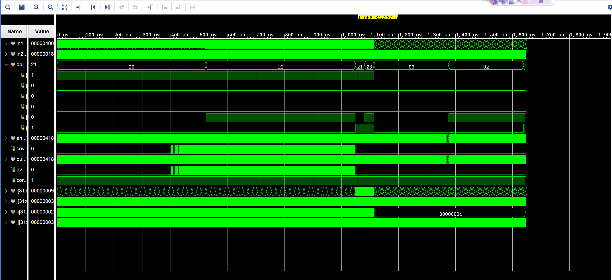

# 实验报告

## 实验目的

该实验是实现一个32位的ALU，并对编写的Verilog文件进行仿真。

## 实验设计思路

首先我设计一个时序逻辑电路，之后在always块中设计一个switch操作并根据Op执行相关的操作。

### 有符号数加

#### 思路

首先我直接将C赋值为A+B，之后判断A、B、C的符号位来判断是否发生溢出现象。若A、B为正数但C为负数，或A、B为负数而C为正数，那么证明发生了溢出，将Over置1。

#### 代码

```verilog
begin
C <= A + B;
Over <= (A[31] & B[31] & !C[31]) | (!A[31] & !B[31] & C[31]); 
end
```

### 无符号加

#### 思路

直接将C赋值为A+B，并将Over置0。

#### 代码

```verilog
begin
C <= A + B;
Over <= 0;
end
```

### 有符号减

#### 思路

首先我直接将C赋值为A+B，之后判断A、B、C的符号位来判断是否发生溢出现象。若A为正数、B为负数数且C为负数或A为负数、B为正数且C为正数，那么证明发生了溢出，将Over置1。

#### 代码

```verilog
begin
C <= A - B;
Over <= (!A[31] & B[31] & C[31]) | (A[31] & !B[31] & !C[31]);
end
```

### 无符号减

#### 思路

直接将C赋值为A-B，并将Over置0。

#### 代码

```verilog
begin
C <= A - B;
Over <= 0;
end
```

### 移位操作与位运算操作

#### 思路

首先将Over置0，之后直接根据Op对应的操作获得结果即可。

#### 代码

```verilog
6'b000000: begin
    Over <= 0;
    C <= B << A;
end
6'b000010: begin
    Over <= 1'b0;
    C <= B >> A;
end
6'b000011: begin
    Over <= 1'b0;
    C <= B;
    for (i = 0; i < A; i = i + 1) begin // 使用符号位进行扩展
        C = {C[31], C[31:1]};
    end
end
6'b100100: begin
    Over <= 1'b0;
    C <= A & B;
end
6'b100101: begin
    Over <= 1'b0;
    C <= A | B;
end
6'b100110: begin
    Over <= 1'b0;
    C <= A ^ B;
end
6'b100111: begin
    Over <= 1'b0;
    C <= ~(A | B);
end
```

## 实验结果仿真

