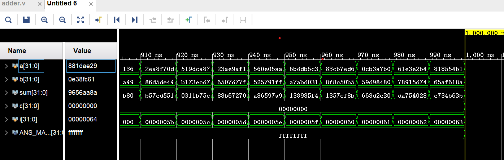

# 实验报告

该实验是实现32位超前进位加法器，以下是实现代码：

### verilog代码

```verilog
`timescale 1ns / 1ps
//////////////////////////////////////////////////////////////////////////////////
// Company: 
// Engineer: 
// 
// Create Date: 2023/09/18 18:44:00
// Design Name: 
// Module Name: adder
// Project Name: 
// Target Devices: 
// Tool Versions: 
// Description: 
// 
// Dependencies: 
// 
// Revision:
// Revision 0.01 - File Created
// Additional Comments:
// 
//////////////////////////////////////////////////////////////////////////////////


module full_adder_1b(
    input a,
    input b,
    input c0,
    output sum,
    output c
);
    assign sum = a ^ b ^ c0;
    assign c = (a & b) || ((a ^ b) & c0);
endmodule

module adder(
    input [31:0] a,
    input [31:0] b,
    output [31:0] sum
    );
    assign sum[0] = a[0] ^ b[0] ^ 0;
    assign sum[1] = a[1] ^ b[1] ^ (a[0] * b[0] + (a[0] ^ b[0]) * 0);
    assign sum[2] = a[2] ^ b[2] ^ (a[1] * b[1] + (a[1] ^ b[1]) * (a[0] * b[0] + (a[0] ^ b[0]) * 0));
    assign sum[3] = a[3] ^ b[3] ^ (a[2] * b[2] + (a[2] ^ b[2]) * (a[1] * b[1] + (a[1] ^ b[1]) * (a[0] * b[0] + (a[0] ^ b[0]) * 0)));
    assign sum[4] = a[4] ^ b[4] ^ (a[3] * b[3] + (a[3] ^ b[3]) * (a[2] * b[2] + (a[2] ^ b[2]) * (a[1] * b[1] + (a[1] ^ b[1]) * (a[0] * b[0] + (a[0] ^ b[0]) * 0))));
    assign sum[5] = a[5] ^ b[5] ^ (a[4] * b[4] + (a[4] ^ b[4]) * (a[3] * b[3] + (a[3] ^ b[3]) * (a[2] * b[2] + (a[2] ^ b[2]) * (a[1] * b[1] + (a[1] ^ b[1]) * (a[0] * b[0] + (a[0] ^ b[0]) * 0)))));
    assign sum[6] = a[6] ^ b[6] ^ (a[5] * b[5] + (a[5] ^ b[5]) * (a[4] * b[4] + (a[4] ^ b[4]) * (a[3] * b[3] + (a[3] ^ b[3]) * (a[2] * b[2] + (a[2] ^ b[2]) * (a[1] * b[1] + (a[1] ^ b[1]) * (a[0] * b[0] + (a[0] ^ b[0]) * 0))))));
    assign sum[7] = a[7] ^ b[7] ^ (a[6] * b[6] + (a[6] ^ b[6]) * (a[5] * b[5] + (a[5] ^ b[5]) * (a[4] * b[4] + (a[4] ^ b[4]) * (a[3] * b[3] + (a[3] ^ b[3]) * (a[2] * b[2] + (a[2] ^ b[2]) * (a[1] * b[1] + (a[1] ^ b[1]) * (a[0] * b[0] + (a[0] ^ b[0]) * 0)))))));
    assign sum[8] = a[8] ^ b[8] ^ (a[7] * b[7] + (a[7] ^ b[7]) * (a[6] * b[6] + (a[6] ^ b[6]) * (a[5] * b[5] + (a[5] ^ b[5]) * (a[4] * b[4] + (a[4] ^ b[4]) * (a[3] * b[3] + (a[3] ^ b[3]) * (a[2] * b[2] + (a[2] ^ b[2]) * (a[1] * b[1] + (a[1] ^ b[1]) * (a[0] * b[0] + (a[0] ^ b[0]) * 0))))))));
    assign sum[9] = a[9] ^ b[9] ^ (a[8] * b[8] + (a[8] ^ b[8]) * (a[7] * b[7] + (a[7] ^ b[7]) * (a[6] * b[6] + (a[6] ^ b[6]) * (a[5] * b[5] + (a[5] ^ b[5]) * (a[4] * b[4] + (a[4] ^ b[4]) * (a[3] * b[3] + (a[3] ^ b[3]) * (a[2] * b[2] + (a[2] ^ b[2]) * (a[1] * b[1] + (a[1] ^ b[1]) * (a[0] * b[0] + (a[0] ^ b[0]) * 0)))))))));
    assign sum[10] = a[10] ^ b[10] ^ (a[9] * b[9] + (a[9] ^ b[9]) * (a[8] * b[8] + (a[8] ^ b[8]) * (a[7] * b[7] + (a[7] ^ b[7]) * (a[6] * b[6] + (a[6] ^ b[6]) * (a[5] * b[5] + (a[5] ^ b[5]) * (a[4] * b[4] + (a[4] ^ b[4]) * (a[3] * b[3] + (a[3] ^ b[3]) * (a[2] * b[2] + (a[2] ^ b[2]) * (a[1] * b[1] + (a[1] ^ b[1]) * (a[0] * b[0] + (a[0] ^ b[0]) * 0))))))))));
    assign sum[11] = a[11] ^ b[11] ^ (a[10] * b[10] + (a[10] ^ b[10]) * (a[9] * b[9] + (a[9] ^ b[9]) * (a[8] * b[8] + (a[8] ^ b[8]) * (a[7] * b[7] + (a[7] ^ b[7]) * (a[6] * b[6] + (a[6] ^ b[6]) * (a[5] * b[5] + (a[5] ^ b[5]) * (a[4] * b[4] + (a[4] ^ b[4]) * (a[3] * b[3] + (a[3] ^ b[3]) * (a[2] * b[2] + (a[2] ^ b[2]) * (a[1] * b[1] + (a[1] ^ b[1]) * (a[0] * b[0] + (a[0] ^ b[0]) * 0)))))))))));
    assign sum[12] = a[12] ^ b[12] ^ (a[11] * b[11] + (a[11] ^ b[11]) * (a[10] * b[10] + (a[10] ^ b[10]) * (a[9] * b[9] + (a[9] ^ b[9]) * (a[8] * b[8] + (a[8] ^ b[8]) * (a[7] * b[7] + (a[7] ^ b[7]) * (a[6] * b[6] + (a[6] ^ b[6]) * (a[5] * b[5] + (a[5] ^ b[5]) * (a[4] * b[4] + (a[4] ^ b[4]) * (a[3] * b[3] + (a[3] ^ b[3]) * (a[2] * b[2] + (a[2] ^ b[2]) * (a[1] * b[1] + (a[1] ^ b[1]) * (a[0] * b[0] + (a[0] ^ b[0]) * 0))))))))))));
    assign sum[13] = a[13] ^ b[13] ^ (a[12] * b[12] + (a[12] ^ b[12]) * (a[11] * b[11] + (a[11] ^ b[11]) * (a[10] * b[10] + (a[10] ^ b[10]) * (a[9] * b[9] + (a[9] ^ b[9]) * (a[8] * b[8] + (a[8] ^ b[8]) * (a[7] * b[7] + (a[7] ^ b[7]) * (a[6] * b[6] + (a[6] ^ b[6]) * (a[5] * b[5] + (a[5] ^ b[5]) * (a[4] * b[4] + (a[4] ^ b[4]) * (a[3] * b[3] + (a[3] ^ b[3]) * (a[2] * b[2] + (a[2] ^ b[2]) * (a[1] * b[1] + (a[1] ^ b[1]) * (a[0] * b[0] + (a[0] ^ b[0]) * 0)))))))))))));
    assign sum[14] = a[14] ^ b[14] ^ (a[13] * b[13] + (a[13] ^ b[13]) * (a[12] * b[12] + (a[12] ^ b[12]) * (a[11] * b[11] + (a[11] ^ b[11]) * (a[10] * b[10] + (a[10] ^ b[10]) * (a[9] * b[9] + (a[9] ^ b[9]) * (a[8] * b[8] + (a[8] ^ b[8]) * (a[7] * b[7] + (a[7] ^ b[7]) * (a[6] * b[6] + (a[6] ^ b[6]) * (a[5] * b[5] + (a[5] ^ b[5]) * (a[4] * b[4] + (a[4] ^ b[4]) * (a[3] * b[3] + (a[3] ^ b[3]) * (a[2] * b[2] + (a[2] ^ b[2]) * (a[1] * b[1] + (a[1] ^ b[1]) * (a[0] * b[0] + (a[0] ^ b[0]) * 0))))))))))))));
    assign sum[15] = a[15] ^ b[15] ^ (a[14] * b[14] + (a[14] ^ b[14]) * (a[13] * b[13] + (a[13] ^ b[13]) * (a[12] * b[12] + (a[12] ^ b[12]) * (a[11] * b[11] + (a[11] ^ b[11]) * (a[10] * b[10] + (a[10] ^ b[10]) * (a[9] * b[9] + (a[9] ^ b[9]) * (a[8] * b[8] + (a[8] ^ b[8]) * (a[7] * b[7] + (a[7] ^ b[7]) * (a[6] * b[6] + (a[6] ^ b[6]) * (a[5] * b[5] + (a[5] ^ b[5]) * (a[4] * b[4] + (a[4] ^ b[4]) * (a[3] * b[3] + (a[3] ^ b[3]) * (a[2] * b[2] + (a[2] ^ b[2]) * (a[1] * b[1] + (a[1] ^ b[1]) * (a[0] * b[0] + (a[0] ^ b[0]) * 0)))))))))))))));
    assign sum[16] = a[16] ^ b[16] ^ (a[15] * b[15] + (a[15] ^ b[15]) * (a[14] * b[14] + (a[14] ^ b[14]) * (a[13] * b[13] + (a[13] ^ b[13]) * (a[12] * b[12] + (a[12] ^ b[12]) * (a[11] * b[11] + (a[11] ^ b[11]) * (a[10] * b[10] + (a[10] ^ b[10]) * (a[9] * b[9] + (a[9] ^ b[9]) * (a[8] * b[8] + (a[8] ^ b[8]) * (a[7] * b[7] + (a[7] ^ b[7]) * (a[6] * b[6] + (a[6] ^ b[6]) * (a[5] * b[5] + (a[5] ^ b[5]) * (a[4] * b[4] + (a[4] ^ b[4]) * (a[3] * b[3] + (a[3] ^ b[3]) * (a[2] * b[2] + (a[2] ^ b[2]) * (a[1] * b[1] + (a[1] ^ b[1]) * (a[0] * b[0] + (a[0] ^ b[0]) * 0))))))))))))))));
    assign sum[17] = a[17] ^ b[17] ^ (a[16] * b[16] + (a[16] ^ b[16]) * (a[15] * b[15] + (a[15] ^ b[15]) * (a[14] * b[14] + (a[14] ^ b[14]) * (a[13] * b[13] + (a[13] ^ b[13]) * (a[12] * b[12] + (a[12] ^ b[12]) * (a[11] * b[11] + (a[11] ^ b[11]) * (a[10] * b[10] + (a[10] ^ b[10]) * (a[9] * b[9] + (a[9] ^ b[9]) * (a[8] * b[8] + (a[8] ^ b[8]) * (a[7] * b[7] + (a[7] ^ b[7]) * (a[6] * b[6] + (a[6] ^ b[6]) * (a[5] * b[5] + (a[5] ^ b[5]) * (a[4] * b[4] + (a[4] ^ b[4]) * (a[3] * b[3] + (a[3] ^ b[3]) * (a[2] * b[2] + (a[2] ^ b[2]) * (a[1] * b[1] + (a[1] ^ b[1]) * (a[0] * b[0] + (a[0] ^ b[0]) * 0)))))))))))))))));
    assign sum[18] = a[18] ^ b[18] ^ (a[17] * b[17] + (a[17] ^ b[17]) * (a[16] * b[16] + (a[16] ^ b[16]) * (a[15] * b[15] + (a[15] ^ b[15]) * (a[14] * b[14] + (a[14] ^ b[14]) * (a[13] * b[13] + (a[13] ^ b[13]) * (a[12] * b[12] + (a[12] ^ b[12]) * (a[11] * b[11] + (a[11] ^ b[11]) * (a[10] * b[10] + (a[10] ^ b[10]) * (a[9] * b[9] + (a[9] ^ b[9]) * (a[8] * b[8] + (a[8] ^ b[8]) * (a[7] * b[7] + (a[7] ^ b[7]) * (a[6] * b[6] + (a[6] ^ b[6]) * (a[5] * b[5] + (a[5] ^ b[5]) * (a[4] * b[4] + (a[4] ^ b[4]) * (a[3] * b[3] + (a[3] ^ b[3]) * (a[2] * b[2] + (a[2] ^ b[2]) * (a[1] * b[1] + (a[1] ^ b[1]) * (a[0] * b[0] + (a[0] ^ b[0]) * 0))))))))))))))))));
    assign sum[19] = a[19] ^ b[19] ^ (a[18] * b[18] + (a[18] ^ b[18]) * (a[17] * b[17] + (a[17] ^ b[17]) * (a[16] * b[16] + (a[16] ^ b[16]) * (a[15] * b[15] + (a[15] ^ b[15]) * (a[14] * b[14] + (a[14] ^ b[14]) * (a[13] * b[13] + (a[13] ^ b[13]) * (a[12] * b[12] + (a[12] ^ b[12]) * (a[11] * b[11] + (a[11] ^ b[11]) * (a[10] * b[10] + (a[10] ^ b[10]) * (a[9] * b[9] + (a[9] ^ b[9]) * (a[8] * b[8] + (a[8] ^ b[8]) * (a[7] * b[7] + (a[7] ^ b[7]) * (a[6] * b[6] + (a[6] ^ b[6]) * (a[5] * b[5] + (a[5] ^ b[5]) * (a[4] * b[4] + (a[4] ^ b[4]) * (a[3] * b[3] + (a[3] ^ b[3]) * (a[2] * b[2] + (a[2] ^ b[2]) * (a[1] * b[1] + (a[1] ^ b[1]) * (a[0] * b[0] + (a[0] ^ b[0]) * 0)))))))))))))))))));
    assign sum[20] = a[20] ^ b[20] ^ (a[19] * b[19] + (a[19] ^ b[19]) * (a[18] * b[18] + (a[18] ^ b[18]) * (a[17] * b[17] + (a[17] ^ b[17]) * (a[16] * b[16] + (a[16] ^ b[16]) * (a[15] * b[15] + (a[15] ^ b[15]) * (a[14] * b[14] + (a[14] ^ b[14]) * (a[13] * b[13] + (a[13] ^ b[13]) * (a[12] * b[12] + (a[12] ^ b[12]) * (a[11] * b[11] + (a[11] ^ b[11]) * (a[10] * b[10] + (a[10] ^ b[10]) * (a[9] * b[9] + (a[9] ^ b[9]) * (a[8] * b[8] + (a[8] ^ b[8]) * (a[7] * b[7] + (a[7] ^ b[7]) * (a[6] * b[6] + (a[6] ^ b[6]) * (a[5] * b[5] + (a[5] ^ b[5]) * (a[4] * b[4] + (a[4] ^ b[4]) * (a[3] * b[3] + (a[3] ^ b[3]) * (a[2] * b[2] + (a[2] ^ b[2]) * (a[1] * b[1] + (a[1] ^ b[1]) * (a[0] * b[0] + (a[0] ^ b[0]) * 0))))))))))))))))))));
    assign sum[21] = a[21] ^ b[21] ^ (a[20] * b[20] + (a[20] ^ b[20]) * (a[19] * b[19] + (a[19] ^ b[19]) * (a[18] * b[18] + (a[18] ^ b[18]) * (a[17] * b[17] + (a[17] ^ b[17]) * (a[16] * b[16] + (a[16] ^ b[16]) * (a[15] * b[15] + (a[15] ^ b[15]) * (a[14] * b[14] + (a[14] ^ b[14]) * (a[13] * b[13] + (a[13] ^ b[13]) * (a[12] * b[12] + (a[12] ^ b[12]) * (a[11] * b[11] + (a[11] ^ b[11]) * (a[10] * b[10] + (a[10] ^ b[10]) * (a[9] * b[9] + (a[9] ^ b[9]) * (a[8] * b[8] + (a[8] ^ b[8]) * (a[7] * b[7] + (a[7] ^ b[7]) * (a[6] * b[6] + (a[6] ^ b[6]) * (a[5] * b[5] + (a[5] ^ b[5]) * (a[4] * b[4] + (a[4] ^ b[4]) * (a[3] * b[3] + (a[3] ^ b[3]) * (a[2] * b[2] + (a[2] ^ b[2]) * (a[1] * b[1] + (a[1] ^ b[1]) * (a[0] * b[0] + (a[0] ^ b[0]) * 0)))))))))))))))))))));
    assign sum[22] = a[22] ^ b[22] ^ (a[21] * b[21] + (a[21] ^ b[21]) * (a[20] * b[20] + (a[20] ^ b[20]) * (a[19] * b[19] + (a[19] ^ b[19]) * (a[18] * b[18] + (a[18] ^ b[18]) * (a[17] * b[17] + (a[17] ^ b[17]) * (a[16] * b[16] + (a[16] ^ b[16]) * (a[15] * b[15] + (a[15] ^ b[15]) * (a[14] * b[14] + (a[14] ^ b[14]) * (a[13] * b[13] + (a[13] ^ b[13]) * (a[12] * b[12] + (a[12] ^ b[12]) * (a[11] * b[11] + (a[11] ^ b[11]) * (a[10] * b[10] + (a[10] ^ b[10]) * (a[9] * b[9] + (a[9] ^ b[9]) * (a[8] * b[8] + (a[8] ^ b[8]) * (a[7] * b[7] + (a[7] ^ b[7]) * (a[6] * b[6] + (a[6] ^ b[6]) * (a[5] * b[5] + (a[5] ^ b[5]) * (a[4] * b[4] + (a[4] ^ b[4]) * (a[3] * b[3] + (a[3] ^ b[3]) * (a[2] * b[2] + (a[2] ^ b[2]) * (a[1] * b[1] + (a[1] ^ b[1]) * (a[0] * b[0] + (a[0] ^ b[0]) * 0))))))))))))))))))))));
    assign sum[23] = a[23] ^ b[23] ^ (a[22] * b[22] + (a[22] ^ b[22]) * (a[21] * b[21] + (a[21] ^ b[21]) * (a[20] * b[20] + (a[20] ^ b[20]) * (a[19] * b[19] + (a[19] ^ b[19]) * (a[18] * b[18] + (a[18] ^ b[18]) * (a[17] * b[17] + (a[17] ^ b[17]) * (a[16] * b[16] + (a[16] ^ b[16]) * (a[15] * b[15] + (a[15] ^ b[15]) * (a[14] * b[14] + (a[14] ^ b[14]) * (a[13] * b[13] + (a[13] ^ b[13]) * (a[12] * b[12] + (a[12] ^ b[12]) * (a[11] * b[11] + (a[11] ^ b[11]) * (a[10] * b[10] + (a[10] ^ b[10]) * (a[9] * b[9] + (a[9] ^ b[9]) * (a[8] * b[8] + (a[8] ^ b[8]) * (a[7] * b[7] + (a[7] ^ b[7]) * (a[6] * b[6] + (a[6] ^ b[6]) * (a[5] * b[5] + (a[5] ^ b[5]) * (a[4] * b[4] + (a[4] ^ b[4]) * (a[3] * b[3] + (a[3] ^ b[3]) * (a[2] * b[2] + (a[2] ^ b[2]) * (a[1] * b[1] + (a[1] ^ b[1]) * (a[0] * b[0] + (a[0] ^ b[0]) * 0)))))))))))))))))))))));
    assign sum[24] = a[24] ^ b[24] ^ (a[23] * b[23] + (a[23] ^ b[23]) * (a[22] * b[22] + (a[22] ^ b[22]) * (a[21] * b[21] + (a[21] ^ b[21]) * (a[20] * b[20] + (a[20] ^ b[20]) * (a[19] * b[19] + (a[19] ^ b[19]) * (a[18] * b[18] + (a[18] ^ b[18]) * (a[17] * b[17] + (a[17] ^ b[17]) * (a[16] * b[16] + (a[16] ^ b[16]) * (a[15] * b[15] + (a[15] ^ b[15]) * (a[14] * b[14] + (a[14] ^ b[14]) * (a[13] * b[13] + (a[13] ^ b[13]) * (a[12] * b[12] + (a[12] ^ b[12]) * (a[11] * b[11] + (a[11] ^ b[11]) * (a[10] * b[10] + (a[10] ^ b[10]) * (a[9] * b[9] + (a[9] ^ b[9]) * (a[8] * b[8] + (a[8] ^ b[8]) * (a[7] * b[7] + (a[7] ^ b[7]) * (a[6] * b[6] + (a[6] ^ b[6]) * (a[5] * b[5] + (a[5] ^ b[5]) * (a[4] * b[4] + (a[4] ^ b[4]) * (a[3] * b[3] + (a[3] ^ b[3]) * (a[2] * b[2] + (a[2] ^ b[2]) * (a[1] * b[1] + (a[1] ^ b[1]) * (a[0] * b[0] + (a[0] ^ b[0]) * 0))))))))))))))))))))))));
    assign sum[25] = a[25] ^ b[25] ^ (a[24] * b[24] + (a[24] ^ b[24]) * (a[23] * b[23] + (a[23] ^ b[23]) * (a[22] * b[22] + (a[22] ^ b[22]) * (a[21] * b[21] + (a[21] ^ b[21]) * (a[20] * b[20] + (a[20] ^ b[20]) * (a[19] * b[19] + (a[19] ^ b[19]) * (a[18] * b[18] + (a[18] ^ b[18]) * (a[17] * b[17] + (a[17] ^ b[17]) * (a[16] * b[16] + (a[16] ^ b[16]) * (a[15] * b[15] + (a[15] ^ b[15]) * (a[14] * b[14] + (a[14] ^ b[14]) * (a[13] * b[13] + (a[13] ^ b[13]) * (a[12] * b[12] + (a[12] ^ b[12]) * (a[11] * b[11] + (a[11] ^ b[11]) * (a[10] * b[10] + (a[10] ^ b[10]) * (a[9] * b[9] + (a[9] ^ b[9]) * (a[8] * b[8] + (a[8] ^ b[8]) * (a[7] * b[7] + (a[7] ^ b[7]) * (a[6] * b[6] + (a[6] ^ b[6]) * (a[5] * b[5] + (a[5] ^ b[5]) * (a[4] * b[4] + (a[4] ^ b[4]) * (a[3] * b[3] + (a[3] ^ b[3]) * (a[2] * b[2] + (a[2] ^ b[2]) * (a[1] * b[1] + (a[1] ^ b[1]) * (a[0] * b[0] + (a[0] ^ b[0]) * 0)))))))))))))))))))))))));
    assign sum[26] = a[26] ^ b[26] ^ (a[25] * b[25] + (a[25] ^ b[25]) * (a[24] * b[24] + (a[24] ^ b[24]) * (a[23] * b[23] + (a[23] ^ b[23]) * (a[22] * b[22] + (a[22] ^ b[22]) * (a[21] * b[21] + (a[21] ^ b[21]) * (a[20] * b[20] + (a[20] ^ b[20]) * (a[19] * b[19] + (a[19] ^ b[19]) * (a[18] * b[18] + (a[18] ^ b[18]) * (a[17] * b[17] + (a[17] ^ b[17]) * (a[16] * b[16] + (a[16] ^ b[16]) * (a[15] * b[15] + (a[15] ^ b[15]) * (a[14] * b[14] + (a[14] ^ b[14]) * (a[13] * b[13] + (a[13] ^ b[13]) * (a[12] * b[12] + (a[12] ^ b[12]) * (a[11] * b[11] + (a[11] ^ b[11]) * (a[10] * b[10] + (a[10] ^ b[10]) * (a[9] * b[9] + (a[9] ^ b[9]) * (a[8] * b[8] + (a[8] ^ b[8]) * (a[7] * b[7] + (a[7] ^ b[7]) * (a[6] * b[6] + (a[6] ^ b[6]) * (a[5] * b[5] + (a[5] ^ b[5]) * (a[4] * b[4] + (a[4] ^ b[4]) * (a[3] * b[3] + (a[3] ^ b[3]) * (a[2] * b[2] + (a[2] ^ b[2]) * (a[1] * b[1] + (a[1] ^ b[1]) * (a[0] * b[0] + (a[0] ^ b[0]) * 0))))))))))))))))))))))))));
    assign sum[27] = a[27] ^ b[27] ^ (a[26] * b[26] + (a[26] ^ b[26]) * (a[25] * b[25] + (a[25] ^ b[25]) * (a[24] * b[24] + (a[24] ^ b[24]) * (a[23] * b[23] + (a[23] ^ b[23]) * (a[22] * b[22] + (a[22] ^ b[22]) * (a[21] * b[21] + (a[21] ^ b[21]) * (a[20] * b[20] + (a[20] ^ b[20]) * (a[19] * b[19] + (a[19] ^ b[19]) * (a[18] * b[18] + (a[18] ^ b[18]) * (a[17] * b[17] + (a[17] ^ b[17]) * (a[16] * b[16] + (a[16] ^ b[16]) * (a[15] * b[15] + (a[15] ^ b[15]) * (a[14] * b[14] + (a[14] ^ b[14]) * (a[13] * b[13] + (a[13] ^ b[13]) * (a[12] * b[12] + (a[12] ^ b[12]) * (a[11] * b[11] + (a[11] ^ b[11]) * (a[10] * b[10] + (a[10] ^ b[10]) * (a[9] * b[9] + (a[9] ^ b[9]) * (a[8] * b[8] + (a[8] ^ b[8]) * (a[7] * b[7] + (a[7] ^ b[7]) * (a[6] * b[6] + (a[6] ^ b[6]) * (a[5] * b[5] + (a[5] ^ b[5]) * (a[4] * b[4] + (a[4] ^ b[4]) * (a[3] * b[3] + (a[3] ^ b[3]) * (a[2] * b[2] + (a[2] ^ b[2]) * (a[1] * b[1] + (a[1] ^ b[1]) * (a[0] * b[0] + (a[0] ^ b[0]) * 0)))))))))))))))))))))))))));
    assign sum[28] = a[28] ^ b[28] ^ (a[27] * b[27] + (a[27] ^ b[27]) * (a[26] * b[26] + (a[26] ^ b[26]) * (a[25] * b[25] + (a[25] ^ b[25]) * (a[24] * b[24] + (a[24] ^ b[24]) * (a[23] * b[23] + (a[23] ^ b[23]) * (a[22] * b[22] + (a[22] ^ b[22]) * (a[21] * b[21] + (a[21] ^ b[21]) * (a[20] * b[20] + (a[20] ^ b[20]) * (a[19] * b[19] + (a[19] ^ b[19]) * (a[18] * b[18] + (a[18] ^ b[18]) * (a[17] * b[17] + (a[17] ^ b[17]) * (a[16] * b[16] + (a[16] ^ b[16]) * (a[15] * b[15] + (a[15] ^ b[15]) * (a[14] * b[14] + (a[14] ^ b[14]) * (a[13] * b[13] + (a[13] ^ b[13]) * (a[12] * b[12] + (a[12] ^ b[12]) * (a[11] * b[11] + (a[11] ^ b[11]) * (a[10] * b[10] + (a[10] ^ b[10]) * (a[9] * b[9] + (a[9] ^ b[9]) * (a[8] * b[8] + (a[8] ^ b[8]) * (a[7] * b[7] + (a[7] ^ b[7]) * (a[6] * b[6] + (a[6] ^ b[6]) * (a[5] * b[5] + (a[5] ^ b[5]) * (a[4] * b[4] + (a[4] ^ b[4]) * (a[3] * b[3] + (a[3] ^ b[3]) * (a[2] * b[2] + (a[2] ^ b[2]) * (a[1] * b[1] + (a[1] ^ b[1]) * (a[0] * b[0] + (a[0] ^ b[0]) * 0))))))))))))))))))))))))))));
    assign sum[29] = a[29] ^ b[29] ^ (a[28] * b[28] + (a[28] ^ b[28]) * (a[27] * b[27] + (a[27] ^ b[27]) * (a[26] * b[26] + (a[26] ^ b[26]) * (a[25] * b[25] + (a[25] ^ b[25]) * (a[24] * b[24] + (a[24] ^ b[24]) * (a[23] * b[23] + (a[23] ^ b[23]) * (a[22] * b[22] + (a[22] ^ b[22]) * (a[21] * b[21] + (a[21] ^ b[21]) * (a[20] * b[20] + (a[20] ^ b[20]) * (a[19] * b[19] + (a[19] ^ b[19]) * (a[18] * b[18] + (a[18] ^ b[18]) * (a[17] * b[17] + (a[17] ^ b[17]) * (a[16] * b[16] + (a[16] ^ b[16]) * (a[15] * b[15] + (a[15] ^ b[15]) * (a[14] * b[14] + (a[14] ^ b[14]) * (a[13] * b[13] + (a[13] ^ b[13]) * (a[12] * b[12] + (a[12] ^ b[12]) * (a[11] * b[11] + (a[11] ^ b[11]) * (a[10] * b[10] + (a[10] ^ b[10]) * (a[9] * b[9] + (a[9] ^ b[9]) * (a[8] * b[8] + (a[8] ^ b[8]) * (a[7] * b[7] + (a[7] ^ b[7]) * (a[6] * b[6] + (a[6] ^ b[6]) * (a[5] * b[5] + (a[5] ^ b[5]) * (a[4] * b[4] + (a[4] ^ b[4]) * (a[3] * b[3] + (a[3] ^ b[3]) * (a[2] * b[2] + (a[2] ^ b[2]) * (a[1] * b[1] + (a[1] ^ b[1]) * (a[0] * b[0] + (a[0] ^ b[0]) * 0)))))))))))))))))))))))))))));
    assign sum[30] = a[30] ^ b[30] ^ (a[29] * b[29] + (a[29] ^ b[29]) * (a[28] * b[28] + (a[28] ^ b[28]) * (a[27] * b[27] + (a[27] ^ b[27]) * (a[26] * b[26] + (a[26] ^ b[26]) * (a[25] * b[25] + (a[25] ^ b[25]) * (a[24] * b[24] + (a[24] ^ b[24]) * (a[23] * b[23] + (a[23] ^ b[23]) * (a[22] * b[22] + (a[22] ^ b[22]) * (a[21] * b[21] + (a[21] ^ b[21]) * (a[20] * b[20] + (a[20] ^ b[20]) * (a[19] * b[19] + (a[19] ^ b[19]) * (a[18] * b[18] + (a[18] ^ b[18]) * (a[17] * b[17] + (a[17] ^ b[17]) * (a[16] * b[16] + (a[16] ^ b[16]) * (a[15] * b[15] + (a[15] ^ b[15]) * (a[14] * b[14] + (a[14] ^ b[14]) * (a[13] * b[13] + (a[13] ^ b[13]) * (a[12] * b[12] + (a[12] ^ b[12]) * (a[11] * b[11] + (a[11] ^ b[11]) * (a[10] * b[10] + (a[10] ^ b[10]) * (a[9] * b[9] + (a[9] ^ b[9]) * (a[8] * b[8] + (a[8] ^ b[8]) * (a[7] * b[7] + (a[7] ^ b[7]) * (a[6] * b[6] + (a[6] ^ b[6]) * (a[5] * b[5] + (a[5] ^ b[5]) * (a[4] * b[4] + (a[4] ^ b[4]) * (a[3] * b[3] + (a[3] ^ b[3]) * (a[2] * b[2] + (a[2] ^ b[2]) * (a[1] * b[1] + (a[1] ^ b[1]) * (a[0] * b[0] + (a[0] ^ b[0]) * 0))))))))))))))))))))))))))))));
    assign sum[31] = a[31] ^ b[31] ^ (a[30] * b[30] + (a[30] ^ b[30]) * (a[29] * b[29] + (a[29] ^ b[29]) * (a[28] * b[28] + (a[28] ^ b[28]) * (a[27] * b[27] + (a[27] ^ b[27]) * (a[26] * b[26] + (a[26] ^ b[26]) * (a[25] * b[25] + (a[25] ^ b[25]) * (a[24] * b[24] + (a[24] ^ b[24]) * (a[23] * b[23] + (a[23] ^ b[23]) * (a[22] * b[22] + (a[22] ^ b[22]) * (a[21] * b[21] + (a[21] ^ b[21]) * (a[20] * b[20] + (a[20] ^ b[20]) * (a[19] * b[19] + (a[19] ^ b[19]) * (a[18] * b[18] + (a[18] ^ b[18]) * (a[17] * b[17] + (a[17] ^ b[17]) * (a[16] * b[16] + (a[16] ^ b[16]) * (a[15] * b[15] + (a[15] ^ b[15]) * (a[14] * b[14] + (a[14] ^ b[14]) * (a[13] * b[13] + (a[13] ^ b[13]) * (a[12] * b[12] + (a[12] ^ b[12]) * (a[11] * b[11] + (a[11] ^ b[11]) * (a[10] * b[10] + (a[10] ^ b[10]) * (a[9] * b[9] + (a[9] ^ b[9]) * (a[8] * b[8] + (a[8] ^ b[8]) * (a[7] * b[7] + (a[7] ^ b[7]) * (a[6] * b[6] + (a[6] ^ b[6]) * (a[5] * b[5] + (a[5] ^ b[5]) * (a[4] * b[4] + (a[4] ^ b[4]) * (a[3] * b[3] + (a[3] ^ b[3]) * (a[2] * b[2] + (a[2] ^ b[2]) * (a[1] * b[1] + (a[1] ^ b[1]) * (a[0] * b[0] + (a[0] ^ b[0]) * 0)))))))))))))))))))))))))))))));
endmodule

```

由上述代码可见，当位数增加，其表达式就更加复杂。同时，其表达式遵循递推式，因此我实现了一个C++代码来自动生成verilog代码。

### C++代码

```C++
#include <iostream>
#include <vector>
#include <fstream>

using namespace std;

const int N = 32;

vector<string> result;

string get_i(string a, int idx) {
    return a + "[" + to_string(idx) + "]";
}

int main() {
    fstream file;
    file.open("output.txt", ios::out);

    string C = "0";
    for (int i = 0; i < N; i ++ ) {
        result.emplace_back("assign ");
        result[i] += get_i("sum", i) + " = " + get_i("a", i) + " ^ " + get_i("b", i) + " ^ " + C;
        C = "(" + get_i("a", i) +  + " * " + get_i("b", i) + " + " + "(" + get_i("a", i) + " ^ " + get_i("b", i) + ")" + " * " + C + ")";
        result[i] += ";";
    }

    for (const auto& it : result)
        file << it << endl;

    file.close();
    return 0;
}
```

以下为实验结果仿真图

### 实验结果



可见误差值C都为0，加法其实现正确。